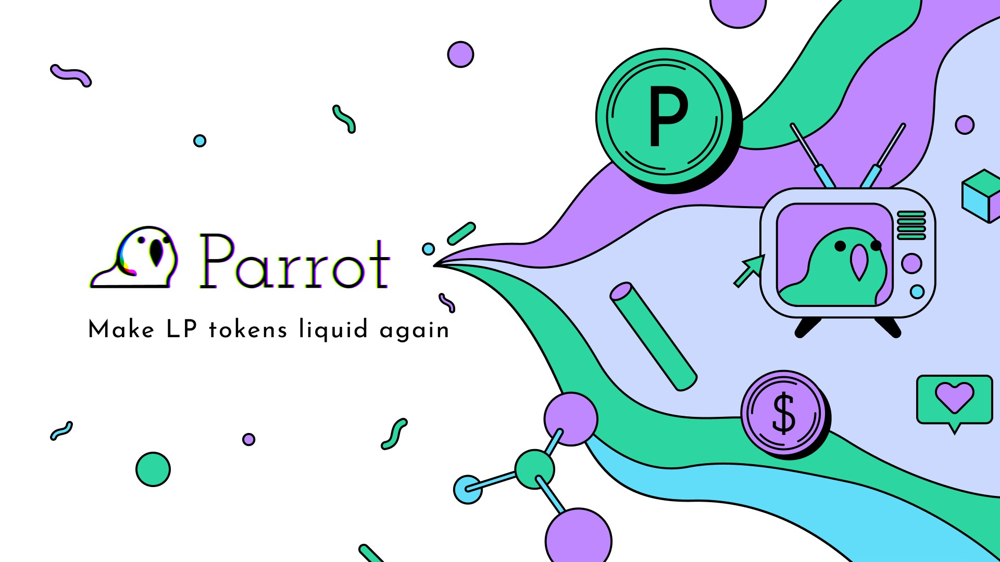

# Introduction

The Parrot Protocol is a DeFi network built on Solana that will include the stablecoin PAI, a non-custodial lending market, and a margin trading vAMM. These are all use cases designed to solve one single problem: making value locked in DeFi systems accessible.

Today billions of dollars of value are locked in hundreds of DeFi systems, and converted into different yield generating tokens, such as the Uniswap LP tokens, or the AAVE interest bearing tokens. There aren’t many use cases available for these LP tokens. The value locked in DeFi as LP tokens are inaccessible, because their risks are opaque, and their units of account unsuitable for human consumption.

The Parrot Protocol is setting out to make value locked in LP tokens accessible, by creating a liquidity & lending network collateralized by these LP tokens. The Secret Parrot Master Plan (just between you and me):

* Create the PAI stablecoin, backed by LP tokens as collaterals. This creates a common unit of account to make it easy for holders of different types of LP tokens to transact with each other.
* Create the Parrot Lending market, taking LP tokens as collaterals. This allows LP holders to access their locked value by borrowing against lender liquidity.
* Create a margin trading product (virtual AMM) using PAI as the common unit of account. This allows the Parrot community to collect fees, and feed the family.

