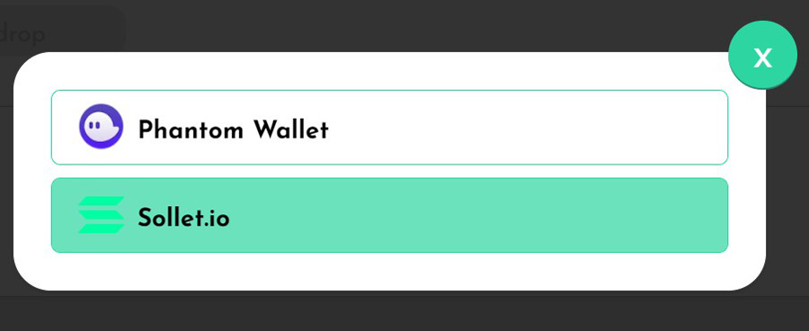
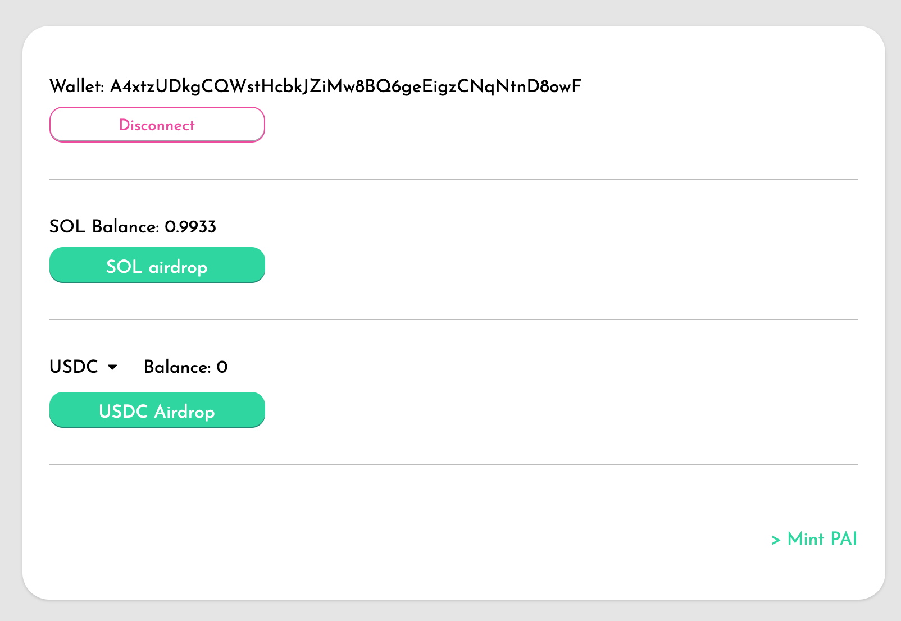

# Devnet Faucet

Parrot is available on the Solana devnet for testing.

[https://dev.partyparrot.finance](https://dev.partyparrot.finance)

This is a tutorial for getting test tokens on the devnet to try minting PAI on devnet.

## Connect Wallet

Click on the "Connect Wallet" button in the top right position of the page:

Then select the wallet you want to connect with:

## Get Devnet Tokens

Navigate to the [Faucet](https://dev.partyparrot.finance/faucet)

1. Click "SOL airdrop" to receive one SOL
2. Click "USDC airdrop" to receive 100 USDC
