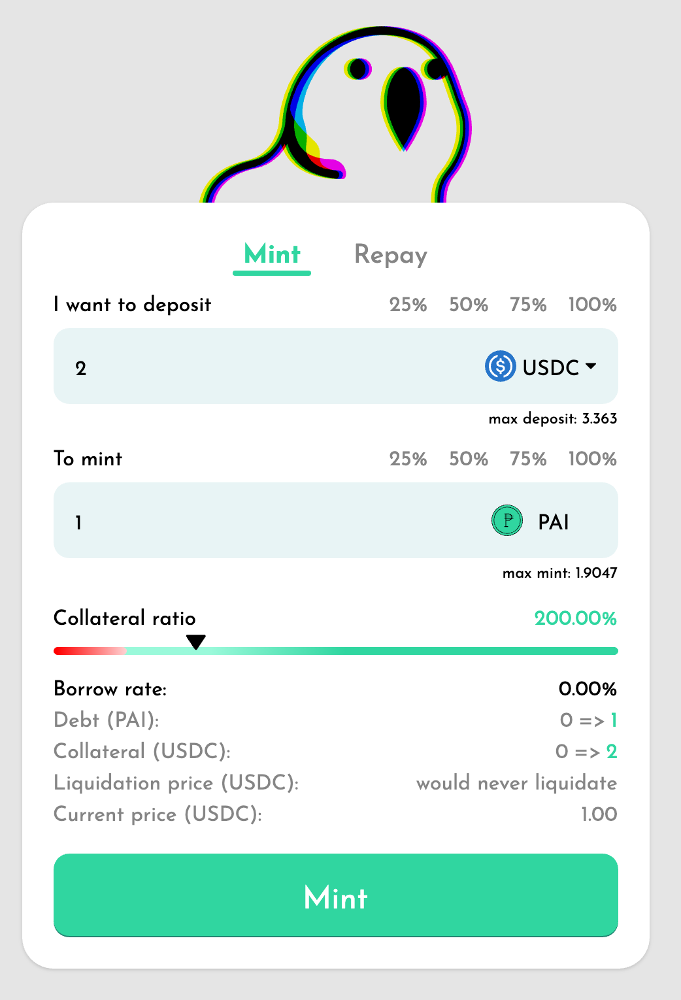
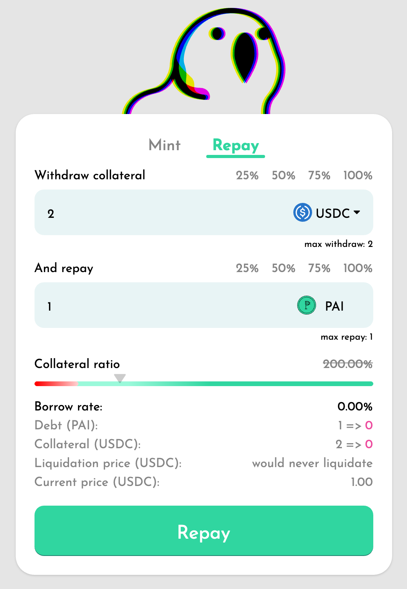
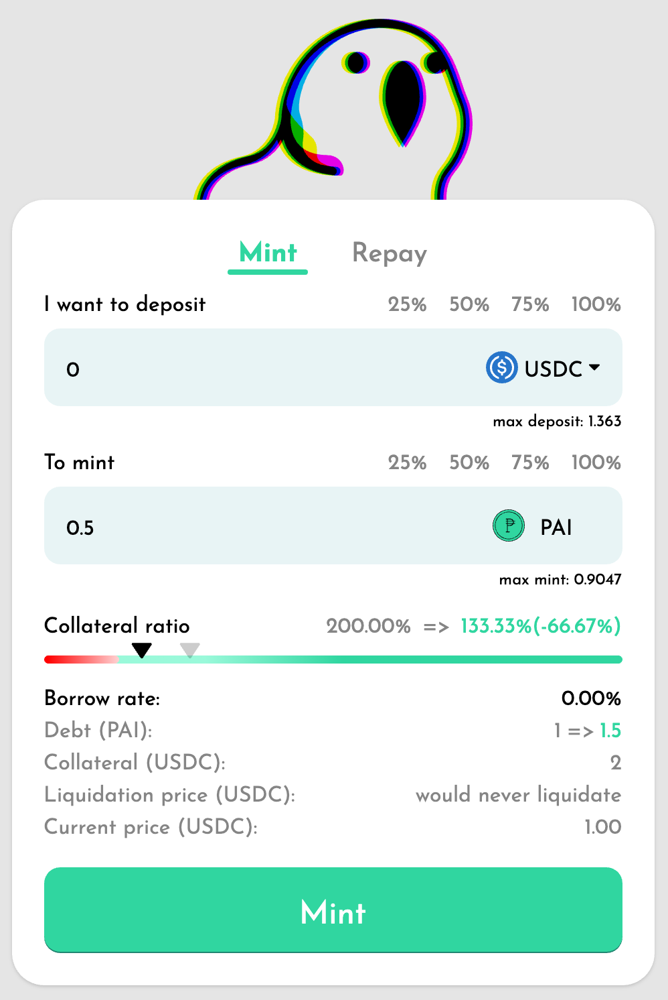
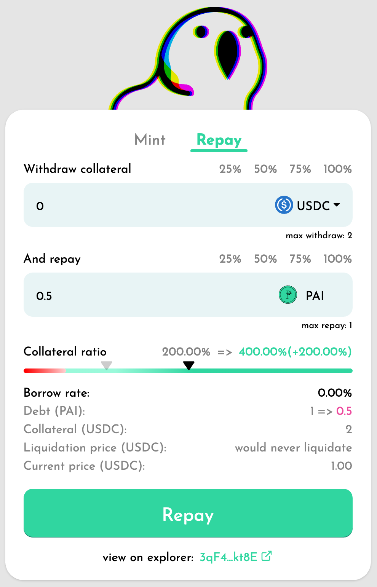
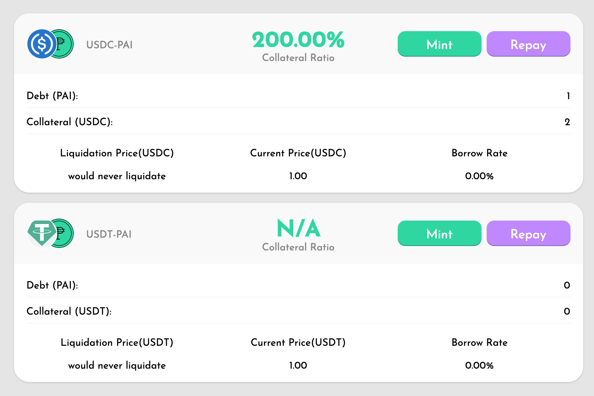

# PAI Tutorial

This tutorial guides you through the process of borrowing and repaying PAI.

Currently, Parrot Finance accepts deposits of SOL, USDC, and USDT as collateral.

|              | Collateral Ratio | Liduidation Ratio | Borrow Interest |
| ------------- | ------------- |--------------|--------------|
| SOL  | 800%  | 150%  | 5%  |
| USDC  | 105%  | none | 0%  |
| USDT  | 105%  | none | 0%  |

Collateral Ratio = (value of deposits) / (value of borrowed assets)

For example, if you deposit $100 worth of SOL, you can mint 12.5 PAI. If you deposit $105 worth of USDC, you can mint 100 PAI.

When your Collateral Ratio falls below the Liquidation Ratio, a bot will liquidate your position. The bot will sell sufficient collateral to repay the debt and return the remaining assets to your wallet.

For stablecoin vaults, the system treats PAI as pegged 1:1 with stablecoins and will never fluctuate. Therefore, your stablecoin deposits will never liquidate.

## Connect Wallet

Click **Connect Wallet** on the top right position of the page.

Select the wallet you want to connect with.

## Borrow PAI

Navigate to the **[Mint](https://partyparrot.finance/mint)** page and click the **Mint** tab.

Try depositing 2 USDC as collateral to mint 1 PAI. After minting, the resulting collateral ratio will be 200%.

## Repay PAI

Navigate to the **[Mint](https://partyparrot.finance/mint)** page and click the **Repay** tab.

Try repaying 1 PAI. You can simultaneously (or at a later time) withdraw the 2 USDC you had deposited as collateral.

## Adjust Collateral Ratio

If there is sufficient collateral in your vault, you can choose to borrow more PAI without depositing additional collateral.

With 2 USDC in the vault and 1 PAI already minted, try minting an additional 0.5 PAI. After minting, the vault's collateral ratio will decrease to 133%.

Another option is to increase your vault's collateral ratio by repaying PAI without withdrawing collateral from the vault.

Try repaying 0.5 PAI without withdrawing USDC. After repaying, the vault's collateral ratio will increase to 400%.

## Manage Vaults

Navigate to the **[Vaults](https://partyparrot.finance/vaults)** page to view and manage your vaults.

This page displays the metrics of each vault: your debt, the amount & price of your deposited collateral, and the borrow interest. You can also mint PAI or repay PAI from this interface.

