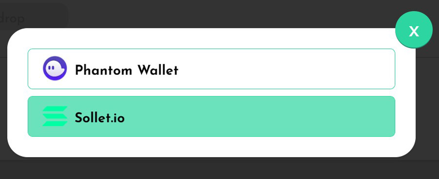

# PAI Tutorial

This tutorial guides you through the process of minting and repaying PAI.

Currently Parrot supports USDC and USDT deposits only, and you can generate 100 PAI for every 105 of USDC (or USDT) collateral.

No interests are collected on PAI generated from stablecoin vaults. Furthermore, for stablecoin vaults, the system treats the price as pegged to 1:1, never to fluctuate. This way stablecoin vaults such as USDC would *never* liquidate.

When price oracles are launched on Solana mainnet, we will introduce non-stable assets such as SOL, ETH, and BTC.

## Connect Wallet

Click on the "Connect Wallet" button in the top right position of the page:

Then select the wallet you want to connect with:

## Mint PAI

Navigate to the [Mint](https://partyparrot.finance/mint) to mint PAI.

Here you deposit 2 USDC as collateral to mint 1 PAI. After minting, the resulting collateral ratio would be 200%.

## Repay PAI

You can repay PAI at the [Mint](https://partyparrot.finance/mint) page, by switching to the "Repay" tab:

Here you repay 1 PAI, while simultaneously withdrawing the 2 USDC deposited as collateral. After repay, the vault would be empty.

## Adjust Collateral Ratio

If there is already sufficient collateral in your vault, you can choose to mint more PAI without depositing additional collateral.

Here you mint an additional 0.5 PAI, and deposit no more USDC. After minting, the vault's collateral ratio decreases to 133%.

Another option is to increase your vault's collateral ratio by repaying PAI without withdrawing collateral from the vault.

Here you repay 0.5 PAI, while keeping the collateral at the same level. After repay, the vault's collateral ratio would increase to 400%.

## Manage Vaults

Navigate to the [Vaults](https://partyparrot.finance/vaults) to view and manage your vaults.

In this page, you can see the stats of your vaults, mint PAI, or repay PAI.

