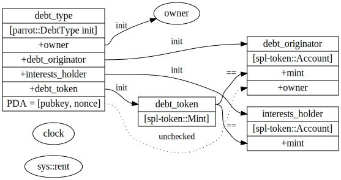

# Instructions

This document contains a list of all instructions related to the Parrot PAI stablecoin.

## Accounts Graph Visualization

For every instruction, we provide an accompanying graph for *every* accounts that must be passed in, and the relationships (if any) that these accounts must satisfy.

* Solid arrows are relationships that must be checked explicitly by our own program.
* Dotted arrows are relationships that exist, but checked by subprogram calls.
* The state struct of an account is given in between bracket.
  * notation: `[<type> <mutability>?]`
  * For example: `[spl-token:Account mut]` denotes that this account should be an spl-token `Account`, and that it should be mutable.
* A round circle is an user controlled account.
  * If the user account needs to provide a signature (e.g. token owner for transfer), then it is marked as `signer`.
* `PDA` denotes program derived account.

## InitDebtType (Admin)

Initializes a `ProgramAccount<DebtType>`. This is done by the debt owner. There is no sanity checking right now, so the admin should take care to use the correct inputs otherwise the system would not work.

* `debt_originator` and `interests_holder` should be spl token accounts of `debt_token` mint.
* `debt_originator.owner` should be the debt_type PDA, with `seeds = [debt_type.pubkey, nonce]`
  * This is not checked by the program
* `debt_type.owner` is checked whether it's signed.
  * This allows admin to throw away the key.
  * This makes multisig owner easier to configure.

```rust
pub fn init_debt_type(ctx: Context<InitDebtType>, nonce: u8) -> Result<()>;

#[derive(Accounts)]
pub struct InitDebtType<'info> {
    #[account(init)]
    debt_type: ProgramAccount<'info, DebtType>,

    debt_token: AccountInfo<'info>,

    #[account("&debt_originator.mint == debt_token.key")]
    debt_originator: CpiAccount<'info, TokenAccount>,

    #[account("&interests_holder.mint == debt_token.key")]
    interests_holder: CpiAccount<'info, TokenAccount>,

    owner: AccountInfo<'info>,

    rent: Sysvar<'info, Rent>,
}
```



## InitVaultType (Admin)

Initializes a `ProgramAccount<VaultType>`. This is done by the debt owner, to create a new vault type that accepts a particular collateral token.

* Only the `debt_type.owner` should be able to initialize a new vault for that `debt_type`.
* `interest_accum_updated` should be set to current slot
* `collateral_token_holder.owner` should be the vault_type PDA, with `seeds = [vault_type.pubkey, nonce]`

```rust

pub fn init_vault_type(
    ctx: Context<InitVaultType>,
    nonce: u8,
    minimum_collateral_ratio: u64,
    liquidation_collateral_ratio: u64,
    liquidation_penalty: u64,
    interest_rate: u128,
    debt_ceiling: u64,
) -> Result<()>;

#[derive(Accounts)]
pub struct InitVaultType<'info> {
    debt_type: ProgramAccount<'info, DebtType>,

    #[account(init)]
    vault_type: ProgramAccount<'info, VaultType>,

    #[account(signer, "&debt_type.owner == owner.key")]
    owner: AccountInfo<'info>,

    collateral_token: AccountInfo<'info>,

    #[account("&collateral_token_holder.mint == collateral_token.key")]
    collateral_token_holder: CpiAccount<'info, TokenAccount>,

    price_oracle: AccountInfo<'info>,

    rent: Sysvar<'info, Rent>,

    clock: Sysvar<'info, Clock>,
}
```


## InitVault (Admin)

Initializes a `ProgramAccount<Vault>`.

* `vault` should be an associated account of the owner address.
* Extra space should be reserved for the vault account for future upgrades.
* `vault_type.interest_accum` should update to the latest clock, then `vault.interest_accum` should be set to `vault_type.interest_accum`
* Should owner be signed?

```rust
pub fn init_vault(ctx: Context<InitVault>) -> Result<()>;

#[derive(Accounts)]
pub struct InitVault<'info> {
    #[account(mut)]
    vault_type: ProgramAccount<'info, VaultType>,

    #[account(init, associated = owner, with = vault_type, space = "240")]
    vault: ProgramAccount<'info, Vault>,

    #[account(signer)]
    owner: AccountInfo<'info>,

    rent: Sysvar<'info, Rent>,

    system_program: AccountInfo<'info>,

    clock: Sysvar<'info, Clock>,
}
```


## UpdateDebtType (Admin)

Admin can reconfigure the debt type.

* Changing `debt_type.owner`.
  * Program doesn't check if the new owner key is signed.
    * It can be PDA controlled account, or a burn address.
* Changing `debt_type.interests_holder`.
  * It should be a SPL token account that holds the debt token.
  * Program doesn't check this.

```rust
pub fn update_debt_type(ctx: Context<UpdateDebtType>, update: DebtTypeUpdate) -> Result<()>;

#[derive(Accounts)]
pub struct UpdateDebtType<'info> {
    #[account(mut)]
    debt_type: ProgramAccount<'info, DebtType>,

    #[account(signer, "&debt_type.owner == owner.key")]
    owner: AccountInfo<'info>,
}

#[derive(Clone, Copy, AnchorDeserialize, AnchorSerialize)]
pub struct DebtTypeUpdate {
    owner: Option<Pubkey>,
    interests_holder: Option<Pubkey>,
}
```

## UpdateVaultType (Admin)

Admin can reconfigure a debt type.

* If updating `interest_rate`, will first accumulate interests up to the current slot using the older interest rate.
* No sanity checks.

```rust
pub fn update_vault_type(ctx: Context<UpdateVaultType>, update: VaultTypeUpdate) -> Result<()>;

#[derive(Accounts)]
pub struct UpdateVaultType<'info> {
    debt_type: ProgramAccount<'info, DebtType>,

    #[account(mut, has_one = debt_type)]
    vault_type: ProgramAccount<'info, VaultType>,

    #[account(signer, "&debt_type.owner == owner.key")]
    owner: AccountInfo<'info>,

    clock: Sysvar<'info, Clock>,
}

#[derive(Clone, Copy, AnchorDeserialize, AnchorSerialize)]
pub struct VaultTypeUpdate {
    minimum_collateral_ratio: Option<u64>,
    liquidation_collateral_ratio: Option<u64>,
    liquidation_penalty: Option<u64>,
    interest_rate: Option<u128>,
    debt_ceiling: Option<u64>,
    price_oracle: Option<Pubkey>,
}
```

## CollectVaultInterests (Admin)

Collect accrued interests. This should transfer `vault_type.accrued_interests` amount of debt tokens from `debt_type.debt_originator` to `debt_type.interests_holder`.

```rust
#[derive(Accounts)]
pub struct CollectVaultInterests<'info> {
    debt_type: ProgramAccount<'info, DebtType>,

    #[account(mut, has_one = debt_type)]
    vault_type: ProgramAccount<'info, VaultType>,

    #[account("token_program.key == &token::ID")]
    token_program: AccountInfo<'info>,

    #[account(mut, "&debt_type.debt_originator == debt_originator.key")]
    debt_originator: AccountInfo<'info>,

    debt_originator_authority: AccountInfo<'info>,

    #[account(mut, "&debt_type.interests_holder == interests_holder.key")]
    interests_holder: AccountInfo<'info>,

    #[account(signer, "&debt_type.owner == owner.key")]
    owner: AccountInfo<'info>,
}
```

## Borrow

Increase `vault.debt_amount`, and transfer debt tokens from `debt_type.debt_originator` to `receiver`.

* After borrow, the collateral ratio must still be above `vault_type.minimum_collateral_ratio`.
* `vault_type.total_debt` must not exceed `vault_type.debt_ceiling`
* Only the `vault.owner` can borrow.
* If `debt_type.debt_originator` no longer has enough debt balance, this transaction should fail.
  * This acts as a global debt ceiling for the whole protocol.
* Our user-facing app will use the associated token address of `vault.owner` as `receiver`.
  * THis is not enforced by the program.

```rust
pub fn borrow(ctx: Context<Borrow>, amount: u64) -> Result<()>;

#[derive(Accounts)]
pub struct Borrow<'info> {
    debt_type: ProgramAccount<'info, DebtType>,

    #[account(mut, has_one = debt_type)]
    vault_type: ProgramAccount<'info, VaultType>,

    #[account("&vault_type.collateral_token == collateral_token_mint.to_account_info().key")]
    collateral_token_mint: CpiAccount<'info, Mint>, //to get token decimal

    #[account(mut, has_one = vault_type)]
    vault: ProgramAccount<'info, Vault>,

    #[account(signer, "&vault.owner == vault_owner.key")]
    vault_owner: AccountInfo<'info>,

    #[account("token_program.key == &token::ID")]
    token_program: AccountInfo<'info>,

    #[account("&debt_type.debt_token ==  debt_token.to_account_info().key")]
    debt_token: CpiAccount<'info, Mint>, //use Mint to get token decimal

    #[account(mut, "&debt_type.debt_originator == debt_originator.key")]
    debt_originator: AccountInfo<'info>,

    #[account()] // PDA
    debt_originator_authority: AccountInfo<'info>,

    #[account(mut)]
    receiver: AccountInfo<'info>,

    #[account("&vault_type.price_oracle == oracle.key")]
    oracle: AccountInfo<'info>,

    clock: Sysvar<'info, Clock>,
}
```


## Stake

Increase `vault.collateral_amount` by transferring collateral tokens from user into `vault_type.collateral_token_holder`.

* Anyone can increase the collateral_amount, not just the vault owner.

```rust
pub fn stake(ctx: Context<Stake>, amount: u64) -> Result<()>;

#[derive(Accounts)]
pub struct Stake<'info> {
    #[account(mut)]
    vault_type: ProgramAccount<'info, VaultType>,

    #[account(mut, has_one = vault_type)]
    vault: ProgramAccount<'info, Vault>,

    #[account("token_program.key == &token::ID")]
    token_program: AccountInfo<'info>,

    #[account(mut)]
    collateral_from: AccountInfo<'info>,

    #[account(signer)]
    collateral_from_authority: AccountInfo<'info>,

    #[account(mut, "&vault_type.collateral_token_holder == collateral_to.key")]
    collateral_to: AccountInfo<'info>,

    clock: Sysvar<'info, Clock>,
}
```


## Repay

Decrease `vault.debt_amount` by transferring debt tokens from user back to the `debt_type.debt_originator`.

* Anyone can pay down the debt of a vault, not necessarily the vault owner.
* If the repay `amount` is larger than `vault.debt_amount`, the excess should not be transferred.
* If after repay, the remaining `vault.debt_amount` is less than 1 (the smallest unit of debt), then consider it dust and zero `vault.debt_amount`.

```rust
pub fn repay(ctx: Context<Repay>, amount: u64) -> Result<()>;

#[derive(Accounts)]
pub struct Repay<'info> {
    debt_type: ProgramAccount<'info, DebtType>,

    #[account(mut, has_one = debt_type)]
    vault_type: ProgramAccount<'info, VaultType>,

    #[account(mut, has_one = vault_type)]
    vault: ProgramAccount<'info, Vault>,

    #[account("token_program.key == &token::ID")]
    token_program: AccountInfo<'info>,

    #[account(mut, "&debt_type.debt_token == debt_token.key")]
    debt_token: AccountInfo<'info>,

    #[account(mut)]
    debt_from: AccountInfo<'info>,

    #[account(signer)]
    debt_from_authority: AccountInfo<'info>,

    #[account(mut, "&debt_type.debt_originator == debt_originator.key")]
    debt_originator: AccountInfo<'info>,

    clock: Sysvar<'info, Clock>,
}
```


## Unstake

Decrease `vault.collateral_amount` by transferring collateral tokens from `vault_type.collateral_token_holder` to `receiver`.

* Only `vault.owner` can unstake.
* After unstake, the collateral ratio must still be above `vault_type.minimum_collateral_ratio`.


```rust
pub fn unstake(ctx: Context<Unstake>, amount: u64) -> Result<()>

#[derive(Accounts)]
pub struct Unstake<'info> {
    debt_type: ProgramAccount<'info, DebtType>,

    #[account(mut, has_one = debt_type)]
    vault_type: ProgramAccount<'info, VaultType>,

    #[account(mut, "&debt_type.debt_token == debt_token.to_account_info().key")]
    debt_token: CpiAccount<'info, Mint>, //to get token decimal

    #[account(mut, has_one = vault_type)]
    vault: ProgramAccount<'info, Vault>,

    #[account("&vault_type.price_oracle == oracle.key")]
    oracle: AccountInfo<'info>,

    #[account(mut, signer, "&vault.owner == vault_owner.key")]
    vault_owner: AccountInfo<'info>,

    #[account("token_program.key == &token::ID")]
    token_program: AccountInfo<'info>,

    #[account(
        mut,
        "&vault_type.collateral_token == collateral_token.to_account_info().key"
    )]
    collateral_token: CpiAccount<'info, Mint>,

    #[account(
        mut,
        "&vault_type.collateral_token_holder == collateral_token_holder.key"
    )]
    collateral_token_holder: AccountInfo<'info>,

    // PDA of vault_type
    collateral_token_holder_authority: AccountInfo<'info>,

    // spl-token account to receive unstaked collateral tokens
    #[account(mut)]
    receiver: AccountInfo<'info>,

    clock: Sysvar<'info, Clock>,
}
```


## Liquidate

TODO

* if `vault_type.priceOracle` is set to `STABLEQRACLE1111111111111111111111111111111`, it is considered a stable vault, and liquidation is disabled.